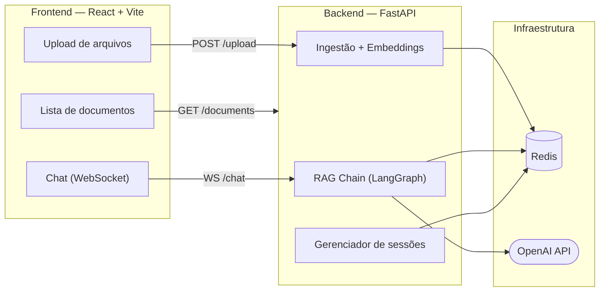

# Pipefy Assistant

Assistente de chat com documentos baseado em RAG (Retrieval-Augmented Generation). Faça upload de arquivos PDF, DOCX ou texto e converse com o conteúdo deles usando linguagem natural — com respostas em streaming via WebSocket.

---

## Visão geral



---

## Funcionalidades

- Upload de documentos PDF, DOCX, TXT e Markdown (com OCR via Tesseract para PDFs escaneados)
- Respostas em **streaming** via WebSocket
- Múltiplas **sessões de conversa** independentes com histórico persistido no Redis
- Busca semântica por similaridade de embeddings (OpenAI `text-embedding-3-small`)
- Listagem e exclusão de documentos ingeridos

---

## Stack

| Camada | Tecnologia |
|--------|-----------|
| Frontend | React 19, TypeScript, Vite 8, Tailwind CSS 4 |
| Backend | FastAPI 0.138, Python 3.12, Uvicorn |
| IA | OpenAI API (GPT + Embeddings), LangGraph 1.0 |
| Armazenamento | Redis 7 |
| Leitura de docs | PyMuPDF, pypdf, python-docx, pytesseract |
| Deploy | AWS ECS Fargate, ECR, ALB, CloudFront |
| CI/CD | GitHub Actions |

---

## Pré-requisitos

**Para rodar com Docker (recomendado):**
- [Docker](https://docs.docker.com/get-docker/) e Docker Compose
- Chave de API da OpenAI

**Para rodar localmente:**
- Python 3.12+
- Node.js 22+
- Redis rodando em `localhost:6379`
- [Tesseract OCR](https://github.com/tesseract-ocr/tesseract) instalado

---

## Início rápido

### 1. Clone e configure as variáveis de ambiente

```bash
git clone <url-do-repositório>
cd pipefy

cp .env.sample .env
```

Edite o `.env` com sua chave da OpenAI:

```env
OPENAI_API_KEY=sk-...
OPENAI_MODEL=gpt-5.4-mini
OPENAI_EMBEDDING_MODEL=text-embedding-3-small
REDIS_URL=redis://redis:6379/0
```

### 2. Suba com Docker Compose

```bash
docker-compose up --build
```

| Serviço | URL |
|---------|-----|
| Frontend | http://localhost:5173 |
| Backend (API) | http://localhost:8000 |
| Docs interativa | http://localhost:8000/docs |
| Redis | localhost:6379 |

---

## Rodando localmente (sem Docker)

```bash
# Redis (necessário em execução)
redis-server

# Backend
cd backend
python -m venv venv && source venv/bin/activate
pip install -r requirements.txt
cp .env.sample .env   # preencher OPENAI_API_KEY
uvicorn app.main:app --reload --port 8000

# Frontend (em outro terminal)
cd frontend
cp .env.sample .env   # VITE_API_URL=http://localhost:8000
npm install
npm run dev
```

---

## Variáveis de ambiente

### Backend (`.env` na raiz ou `backend/.env`)

| Variável | Padrão | Descrição |
|----------|--------|-----------|
| `OPENAI_API_KEY` | — | **Obrigatória.** Chave da API da OpenAI |
| `OPENAI_MODEL` | `gpt-5.4-mini` | Modelo de chat |
| `OPENAI_EMBEDDING_MODEL` | `text-embedding-3-small` | Modelo de embeddings |
| `REDIS_URL` | `redis://localhost:6379/0` | Conexão com o Redis |

### Frontend (`frontend/.env`)

| Variável | Padrão | Descrição |
|----------|--------|-----------|
| `VITE_API_URL` | `http://localhost:8000` | URL base do backend |

---

## API

| Método | Rota | Descrição |
|--------|------|-----------|
| `GET` | `/health` | Health check |
| `POST` | `/upload/` | Upload de um ou mais arquivos |
| `GET` | `/documents/` | Lista documentos ingeridos |
| `DELETE` | `/documents/{id}` | Remove um documento |
| `POST` | `/session/` | Cria sessão de conversa |
| `GET` | `/session/` | Lista sessões |
| `GET` | `/session/{id}` | Busca sessão por ID |
| `PUT` | `/session/{id}` | Renomeia sessão |
| `DELETE` | `/session/{id}` | Remove sessão |
| `POST` | `/chat/` | Pergunta (resposta síncrona) |
| `WS` | `/chat/` | Chat em streaming via WebSocket |

Documentação interativa completa disponível em `/docs` (Swagger UI) e `/redoc`.

---

## Testes

```bash
cd backend
pip install -r requirements-test.txt
pytest
```

Os testes usam `fakeredis` e `httpx` — não é necessário Redis real nem chave da OpenAI.

---

## Deploy (AWS ECS)

O pipeline de CI/CD está em [`.github/workflows/deploy-backend.yml`](.github/workflows/deploy-backend.yml). No push para `master` com alterações em `backend/**`, ele:

1. Faz build e push da imagem Docker para o **ECR**
2. Provisiona toda a infraestrutura AWS de forma idempotente:
   - Cluster **ECS Fargate** (`pipefy-cluster`)
   - **Application Load Balancer** com health check em `/health`
   - **CloudFront** com HTTPS e redirect automático de HTTP → HTTPS
   - IAM role, log group CloudWatch e security groups
3. Registra nova revisão da Task Definition e atualiza o serviço

### Secrets necessários no GitHub

| Secret | Descrição |
|--------|-----------|
| `AWS_ACCESS_KEY_ID` | Credencial IAM do CI |
| `AWS_SECRET_ACCESS_KEY` | Credencial IAM do CI |
| `AWS_REGION` | Região AWS (ex: `us-east-1`) |
| `OPENAI_API_KEY` | Chave da OpenAI |
| `REDIS_URL` | URL do Redis (ex: Upstash ou ElastiCache) |

> A URL HTTPS do backend (`https://*.cloudfront.net`) é exibida no summary da action após o primeiro deploy. Atualize `VITE_API_URL` no Amplify com esse valor.

---

## Estrutura do projeto

```
pipefy/
├── backend/
│   ├── app/
│   │   ├── main.py          # Entry point FastAPI
│   │   ├── config.py        # Configurações via env vars
│   │   ├── models/          # Schemas Pydantic
│   │   ├── routers/         # chat, documents, session, upload
│   │   └── services/        # ingestão, embeddings, RAG, Redis
│   ├── tests/               # Testes com pytest
│   ├── Dockerfile
│   └── requirements.txt
├── frontend/
│   ├── src/
│   │   ├── App.tsx
│   │   └── components/      # ChatWindow, FileUpload, DocumentList
│   ├── Dockerfile
│   └── package.json
├── .github/
│   └── workflows/
│       └── deploy-backend.yml
├── docker-compose.yml
└── docs/
    ├── ARCHITECTURE.md      # Arquitetura detalhada e protocolo WebSocket
    └── RUNNING.md           # Guia de execução e troubleshooting
```

---

## Licença

Projeto pessoal — uso livre.
