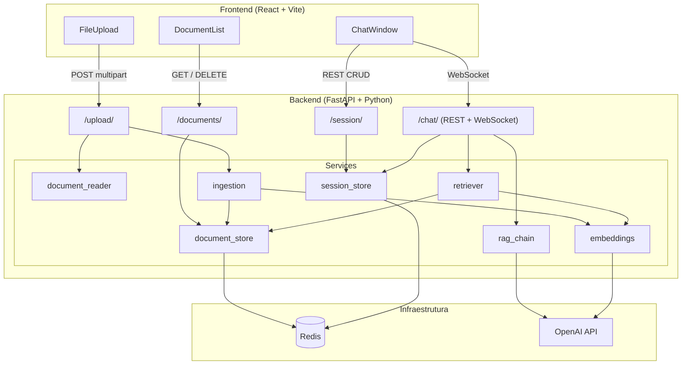
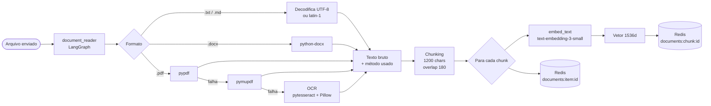
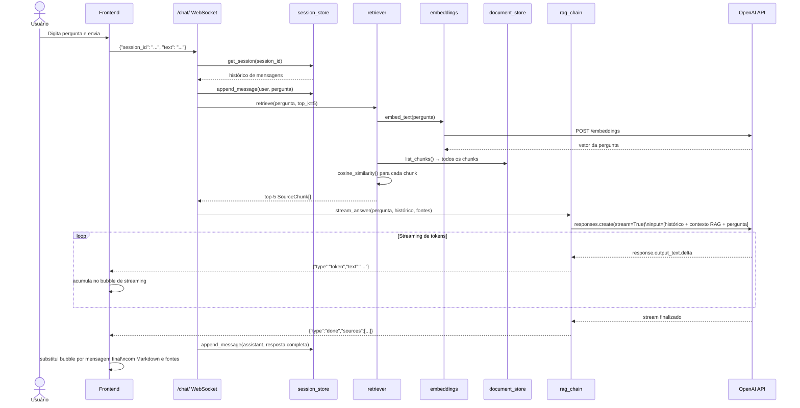
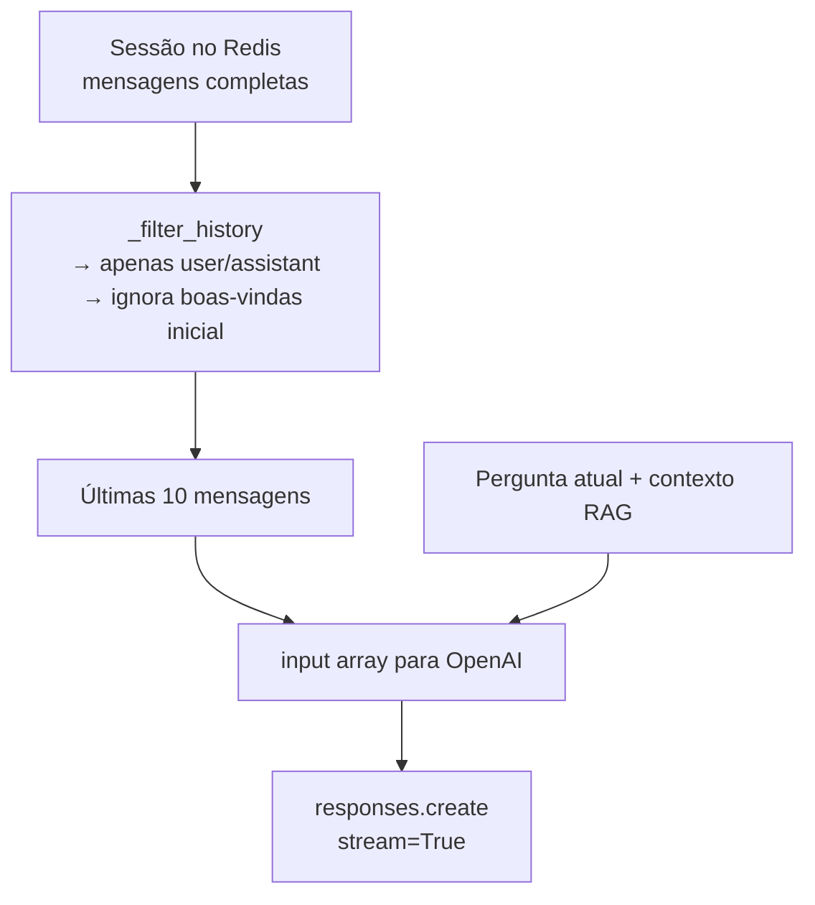

# Arquitetura — Pipefy Assistant

Sistema de **chat com documentos (RAG — Retrieval-Augmented Generation)** que permite fazer perguntas em linguagem natural sobre arquivos enviados (PDF, DOCX, TXT, MD), recebendo respostas fundamentadas nos trechos mais relevantes, com histórico de conversa e streaming em tempo real.

---

## Visão geral dos componentes



---

## Estrutura de pastas

```
pipefy/
├── .env                        # Variáveis de ambiente (raiz)
├── .env.sample
├── docker-compose.yml
│
├── backend/
│   ├── Dockerfile
│   ├── requirements.txt
│   └── app/
│       ├── main.py             # Entrypoint FastAPI
│       ├── config.py           # Settings via env vars
│       ├── models/
│       │   └── schemas.py      # Pydantic models
│       ├── routers/
│       │   ├── chat.py         # Endpoints /chat/
│       │   ├── documents.py    # Endpoints /documents/
│       │   ├── session.py      # Endpoints /session/
│       │   └── upload.py       # Endpoint /upload/
│       └── services/
│           ├── document_reader.py   # Extração de texto (LangGraph)
│           ├── document_store.py    # CRUD Redis para docs/chunks
│           ├── embeddings.py        # Embeddings + cosine similarity
│           ├── ingestion.py         # Pipeline de ingestão
│           ├── openai_client.py     # AsyncOpenAI factory
│           ├── rag_chain.py         # RAG + LLM com streaming
│           ├── retriever.py         # Busca semântica
│           └── session_store.py     # CRUD Redis para sessões
│
└── frontend/
    ├── Dockerfile
    ├── package.json
    ├── vite.config.ts
    └── src/
        ├── App.tsx
        └── components/
            ├── ChatWindow.tsx
            ├── DocumentList.tsx
            └── FileUpload.tsx
```

---

## Pipeline de ingestão de documentos

Fluxo acionado ao enviar um arquivo via `POST /upload/`:



### Detalhes do chunking

| Parâmetro | Valor |
|-----------|-------|
| Tamanho do chunk | 1200 caracteres |
| Overlap entre chunks | 180 caracteres |
| Modelo de embedding | `text-embedding-3-small` |
| Dimensão do vetor | 1536 |

---

## Pipeline de recuperação e geração (RAG)

Fluxo acionado quando o usuário envia uma mensagem via WebSocket:



---

## Protocolo WebSocket do chat

### Mensagem enviada pelo frontend

```json
{
  "session_id": "uuid",
  "text": "Quais são os requisitos para a obra?"
}
```

### Eventos recebidos do backend

| `type` | Campos extras | Descrição |
|--------|--------------|-----------|
| `token` | `session_id`, `text` | Fragmento de texto gerado (streaming) |
| `done`  | `session_id`, `sources[]` | Fim da resposta; inclui fontes |
| `error` | `session_id`, `text` | Erro na chamada à OpenAI |

**Estrutura de `sources[]`:**

```json
{
  "chunk": "trecho do documento relevante...",
  "source": "nome-do-arquivo.pdf",
  "score": 0.8734
}
```

---

## Gerenciamento de histórico de conversa

O modelo recebe até as **últimas 10 mensagens** (5 turnos completos) da sessão como contexto conversacional.



Isso permite:
- Perguntas de acompanhamento: *"fale mais sobre isso"*
- Referências implícitas: *"qual o segundo item da lista?"*
- Continuidade temática entre turnos

---

## API REST — Referência completa

### `/health`

| Método | Rota | Resposta |
|--------|------|----------|
| `GET` | `/health` | `{"status": "ok"}` |

### `/upload`

| Método | Rota | Body | Resposta |
|--------|------|------|----------|
| `POST` | `/upload/` | `multipart/form-data` campo `files` | `UploadedDocument[]` |

### `/documents`

| Método | Rota | Resposta |
|--------|------|----------|
| `GET` | `/documents/` | `UploadedDocument[]` |
| `DELETE` | `/documents/{id}` | `204 No Content` |

### `/session`

| Método | Rota | Body | Resposta |
|--------|------|------|----------|
| `POST` | `/session/` | `{"name": "..."}` | `ChatSession` (201) |
| `GET` | `/session/` | — | `ChatSession[]` |
| `GET` | `/session/{id}` | — | `ChatSession` |
| `PUT` | `/session/{id}` | `{"name": "..."}` | `ChatSession` |
| `DELETE` | `/session/{id}` | — | `204 No Content` |

### `/chat`

| Método | Rota | Body | Resposta |
|--------|------|------|----------|
| `POST` | `/chat/` | `{"question":"...","session_id":"...","top_k":5}` | `ChatResponse` |
| `WebSocket` | `/chat/` | `{"session_id":"...","text":"..."}` | eventos streaming |

---

## Estrutura de dados no Redis

```mermaid
erDiagram
    DOCUMENTS_INDEX {
        sorted_set "documents:index"
        string document_id
        float score "timestamp created_at"
    }

    DOCUMENT {
        string "documents:item:{id}"
        string id
        string filename
        string content_type
        string reader_method
        int chunks_count
        string created_at
    }

    CHUNKS_INDEX {
        set "documents:chunks"
        string chunk_id
    }

    CHUNK {
        string "documents:chunk:{id}"
        string id
        string document_id
        string source
        string content
        float_array embedding
        string reader_method
        string created_at
    }

    SESSIONS_INDEX {
        sorted_set "chat:sessions"
        string session_id
        float score "timestamp updated_at"
    }

    SESSION {
        string "chat:session:{id}"
        string id
        string name
        array messages
        string created_at
        string updated_at
    }

    DOCUMENTS_INDEX ||--o{ DOCUMENT : "referencia"
    CHUNKS_INDEX ||--o{ CHUNK : "referencia"
    DOCUMENT ||--o{ CHUNK : "document_id"
    SESSIONS_INDEX ||--o{ SESSION : "referencia"
```

---

## Stack tecnológica

### Backend

| Camada | Tecnologia | Versão |
|--------|-----------|--------|
| Framework web | FastAPI | 0.138.0 |
| Servidor ASGI | Uvicorn | 0.49.0 |
| Cache/Storage | Redis (asyncio) | 7.1.0 |
| LLM / Embeddings | OpenAI SDK | >=2.0.0, <3.0.0 |
| Orquestração leitura | LangGraph | 1.0.6 |
| Leitura PDF | pypdf + pymupdf | 6.4.1 / 1.26.7 |
| Leitura DOCX | python-docx | 1.2.0 |
| OCR | pytesseract + Pillow | 0.3.13 / 12.0.0 |

### Frontend

| Camada | Tecnologia | Versão |
|--------|-----------|--------|
| UI | React | ^19.2.7 |
| Build | Vite | ^8.1.0 |
| Linguagem | TypeScript | ~6.0.2 |
| Estilos | Tailwind CSS | ^4.3.1 |
| Markdown | react-markdown | ^10.x |
| Linter | oxlint | ^1.69.0 |

### Infraestrutura

| Componente | Tecnologia |
|-----------|-----------|
| Container orchestration | Docker Compose |
| Frontend prod | nginx:alpine (porta 80) |
| Backend image | python:3.12-slim |
| OCR (sistema) | tesseract-ocr + tesseract-ocr-por |

---

## Variáveis de ambiente

| Variável | Onde usar | Obrigatória | Padrão |
|----------|-----------|-------------|--------|
| `OPENAI_API_KEY` | backend | **Sim** | — |
| `OPENAI_MODEL` | backend | Não | `gpt-5.4-mini` |
| `OPENAI_EMBEDDING_MODEL` | backend | Não | `text-embedding-3-small` |
| `REDIS_URL` | backend | Não | `redis://localhost:6379/0` |
| `VITE_API_URL` | frontend (build) | Não | `http://localhost:8000` |

> **Docker Compose:** o `REDIS_URL` é sobrescrito automaticamente para `redis://redis:6379/0` via `environment` no `docker-compose.yml`.
> O `VITE_API_URL` é embutido em tempo de build (variável Vite), portanto deve apontar para o endereço que o **browser** usa para acessar o backend.

---

## Limitações e observações

| Item | Detalhe |
|------|---------|
| Retrieval in-memory | `retrieve()` carrega todos os chunks do Redis a cada pergunta — adequado para volumes pequenos |
| Sem banco vetorial | Similaridade calculada em Python puro (cosine similarity) |
| Embeddings salvos no Redis | Cada chunk armazena seu vetor completo (1536 floats) como JSON |
| Sem TTL no Redis | Dados persistem até exclusão explícita ou remoção do volume Docker |
| Exclusão de documento | Remove documento + todos os chunks associados do Redis |
| Histórico limitado | Apenas os últimos 10 mensagens são enviadas ao modelo |
