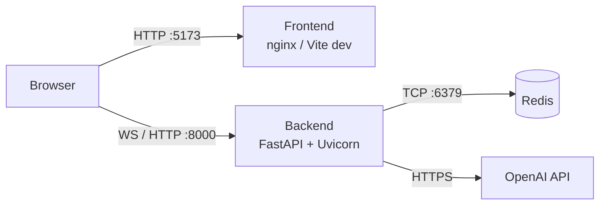

# Como rodar o projeto

Este guia cobre duas formas de executar o **Pipefy Assistant**: com **Docker Compose** (recomendado) ou **localmente** (para desenvolvimento).

---

## Pré-requisitos

### Docker Compose (recomendado)

- [Docker Desktop](https://www.docker.com/products/docker-desktop/) ≥ 4.x (inclui Docker Compose v2)
- Chave de API da OpenAI

### Modo local (desenvolvimento)

- Python 3.12+
- Node.js 22+
- Redis rodando localmente (porta 6379)
- Tesseract OCR instalado no sistema
- Chave de API da OpenAI

---

## Configuração do arquivo `.env`

Copie o arquivo de exemplo na raiz do projeto e preencha sua chave:

```bash
cp .env.sample .env
```

Edite o `.env`:

```dotenv
# Obrigatório
OPENAI_API_KEY=sk-...

# Opcionais (valores padrão mostrados)
OPENAI_MODEL=gpt-5.4-mini
OPENAI_EMBEDDING_MODEL=text-embedding-3-small
REDIS_URL=redis://localhost:6379/0
VITE_API_URL=http://localhost:8000
```

> O Docker Compose lê o `.env` da raiz e o repassa ao backend automaticamente.
> O `REDIS_URL` é sobrescrito pelo Compose para `redis://redis:6379/0` (nome do serviço interno).

---

## Opção 1 — Docker Compose (recomendado)

### Subir todos os serviços

```bash
docker-compose up --build
```

O comando irá:
1. Baixar as imagens base (`python:3.12-slim`, `node:22-alpine`, `nginx:alpine`, `redis:latest`)
2. Instalar dependências do backend (`pip install`)
3. Instalar e buildar o frontend (`npm ci && npm run build`)
4. Iniciar Redis, Backend e Frontend

### Acessar a aplicação

| Serviço | URL |
|---------|-----|
| Frontend | http://localhost:5173 |
| Backend API | http://localhost:8000 |
| Docs interativas (Swagger) | http://localhost:8000/docs |
| Health check | http://localhost:8000/health |

### Parar os serviços

```bash
# Para e mantém os volumes (dados preservados)
docker-compose down

# Para e remove os volumes (apaga dados do Redis)
docker-compose down -v
```

### Rebuildar apenas um serviço

```bash
# Apenas o backend
docker-compose up --build backend

# Apenas o frontend
docker-compose up --build frontend
```

### Ver logs

```bash
# Todos os serviços
docker-compose logs -f

# Apenas o backend
docker-compose logs -f backend
```

---

## Opção 2 — Modo local (desenvolvimento)

### 1. Redis

O Redis pode ser iniciado via Docker (sem precisar instalar localmente):

```bash
docker run -d --name redis -p 6379:6379 redis:latest
```

Ou, se tiver instalado localmente:

```bash
# macOS (Homebrew)
brew services start redis

# Ubuntu/Debian
sudo systemctl start redis
```

### 2. Backend (FastAPI)

```bash
cd backend

# Criar e ativar ambiente virtual
python3.12 -m venv venv
source venv/bin/activate        # Linux/macOS
# ou
venv\Scripts\activate           # Windows

# Instalar dependências
pip install -r requirements.txt

# Configurar variáveis de ambiente (lê .env da raiz e backend/.env)
cp .env.sample .env
# Preencha OPENAI_API_KEY no backend/.env

# Iniciar o servidor
uvicorn app.main:app --reload --host 0.0.0.0 --port 8000
```

O servidor reinicia automaticamente a cada mudança de código graças ao `--reload`.

> **Tesseract (OCR):** necessário para processar PDFs escaneados.
> ```bash
> # macOS
> brew install tesseract tesseract-lang
>
> # Ubuntu/Debian
> sudo apt-get install tesseract-ocr tesseract-ocr-por
> ```

### 3. Frontend (React + Vite)

Em um novo terminal:

```bash
cd frontend

# Instalar dependências
npm install

# Configurar variável de ambiente
cp .env.sample .env
# VITE_API_URL=http://localhost:8000  (já é o padrão)

# Iniciar servidor de desenvolvimento
npm run dev
```

O Vite HMR (Hot Module Replacement) recarrega o browser automaticamente a cada mudança.

Acesse em: **http://localhost:5173**

---

## Estrutura dos serviços



| Serviço | Porta | Modo local | Docker |
|---------|-------|-----------|--------|
| Frontend | 5173 | Vite dev server | nginx:alpine |
| Backend | 8000 | uvicorn --reload | uvicorn |
| Redis | 6379 | local / docker | redis:latest |

---

## Usando a aplicação

### 1. Upload de documentos

1. No painel direito, clique em **"Arraste ou clique para selecionar"** ou arraste arquivos diretamente
2. Formatos aceitos: `.pdf`, `.txt`, `.md`, `.docx`
3. Clique em **"Enviar arquivos"**
4. Aguarde o processamento — o sistema extrai texto, gera chunks e embeddings automaticamente
5. Os documentos aparecem na lista abaixo com nome, data e quantidade de chunks

### 2. Chat com documentos

1. Selecione uma sessão na sidebar esquerda ou crie uma nova com **"Novo"**
2. Digite sua pergunta no campo inferior e pressione Enter ou clique em **"Enviar"**
3. A resposta chega em streaming — você vê o texto sendo gerado em tempo real
4. Abaixo da resposta, os trechos dos documentos usados como fonte são exibidos com score de relevância

### 3. Gerenciar sessões e documentos

- **Renomear sessão:** clique no campo do nome e pressione Enter
- **Excluir sessão:** passe o mouse sobre a sessão na sidebar e clique no `×`
- **Excluir documento:** passe o mouse sobre o documento e clique no ícone de lixeira

---

## Solução de problemas

### Backend não conecta ao Redis

```
ConnectionRefusedError: [Errno 111] Connection refused
```

Verifique se o Redis está rodando:
```bash
redis-cli ping
# Esperado: PONG
```

### Erro de API Key

```
AuthenticationError: Incorrect API key provided
```

Verifique se `OPENAI_API_KEY` está definida corretamente no `.env`.

### Frontend não consegue conectar ao backend (WebSocket offline)

Verifique se `VITE_API_URL` aponta para o backend correto. Em modo local deve ser `http://localhost:8000`. **Em Docker**, o valor é embutido em tempo de build — se mudar a URL, é necessário rebuildar o frontend:

```bash
docker-compose up --build frontend
```

### PDF não é lido corretamente

O sistema tenta automaticamente 3 estratégias em cascata: `pypdf` → `pymupdf` → OCR com Tesseract. Se o OCR não funcionar, instale o Tesseract:

```bash
# macOS
brew install tesseract tesseract-lang

# Ubuntu/Debian
sudo apt-get install tesseract-ocr tesseract-ocr-por
```

### Limpeza completa dos dados

```bash
# Remove todos os dados do Redis (documentos, chunks, sessões)
docker-compose down -v

# Ou conectando diretamente ao Redis
redis-cli FLUSHALL
```
